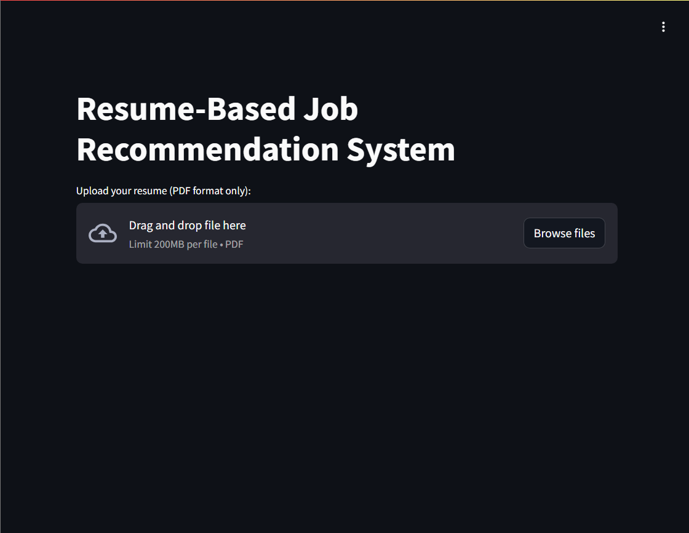
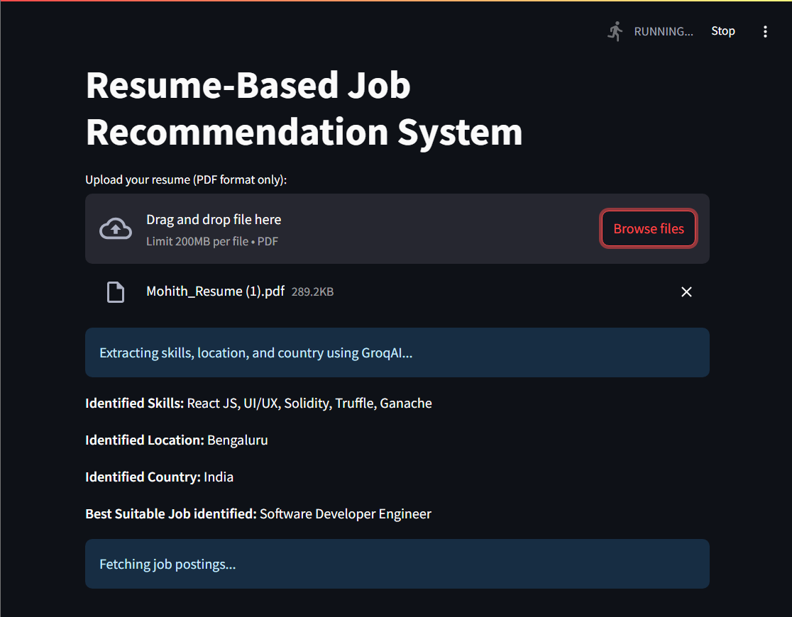
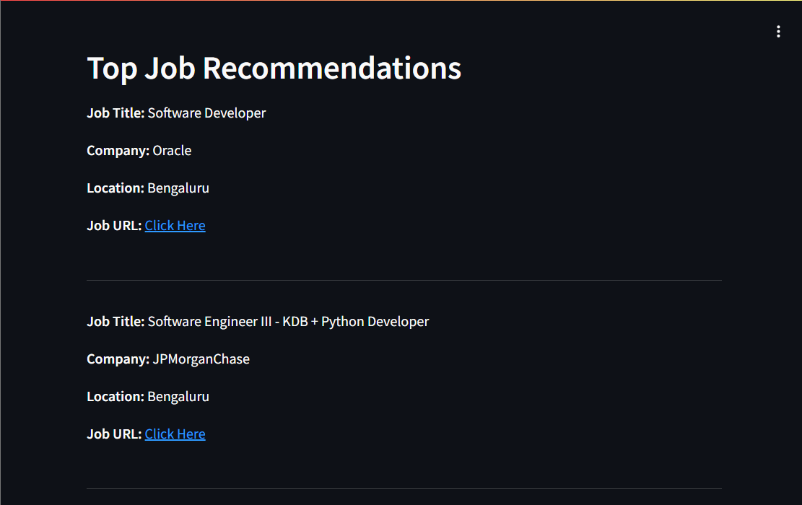

# 🤖 AI-Powered Resume-Based Job Recommendation System

This project is an AI-driven job recommendation system that analyzes resumes and fetches suitable job postings based on extracted skills, location, and job role. 🚀

## 🏗️ Features

✅ Extracts skills, location, and job title from resumes using **GroqAI** 🤯  
✅ Fetches real-time job postings from **Indeed** and other platforms using **JobSpy** 🔎  
✅ Uses **TF-IDF and Spark ML** for job matching with resume content ⚡  
✅ Interactive UI built with **Streamlit** 🎨  
✅ Supports **PDF Resumes** 📄  

## 🎬 Demo Screenshots

### 🔍 Upload Resume


### 📄 Extracted Resume Data


### 🔥 Job Recommendations


## 🚀 Tech Stack

| Technology  | Description |
|-------------|------------|
| **Streamlit** 🎨 | UI for user interaction |
| **PySpark** ⚡ | ML-based text processing (TF-IDF) |
| **JobSpy** 🔎 | Scraping real-time job postings |
| **GroqAI** 🤖 | Extracts skills, location, and job role |
| **PyPDF2** 📄 | Reads and extracts text from PDFs |

## 🛠️ Installation & Setup

1. **Clone the repository**  
   ```bash
   git clone https://github.com/mohithn2004/AI-Job-Recommender
   cd resume-job-recommendation
   ```

2. **Install dependencies**  
   ```bash
   pip install -r requirements.txt
   ```

3. **Run the Streamlit app**  
   ```bash
   streamlit run app.py
   ```

## 📌 How It Works?

1️⃣ Upload your **resume (PDF format)** 📄  
2️⃣ AI extracts **skills, location, and job title** using **GroqAI** 🤖  
3️⃣ Fetches **top job postings** from job portals 🔍  
4️⃣ Uses **TF-IDF similarity** to recommend the best-matching jobs ✨  
5️⃣ View job details & apply directly! 🚀  

## 📬 Contact

Have feedback or want to contribute?  
📧 Email: [mohithn2004@gmail.com](mailto:mohithn2004@gmail.com)  
🔗 Portfolio: [Mohith N](https://mohithnportfolio.netlify.app/)

---

Made with ❤️ by **Mohith N** 🚀
